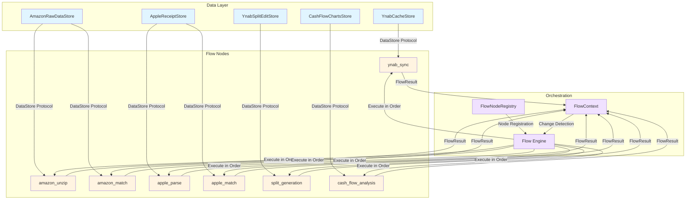

# System Architecture

**Last Updated**: 2025-10-18

## Overview

The Davis Family Finances system is a Python-based financial management tool designed to automate
  transaction categorization, receipt parsing, and financial analysis.
The system uses a **flow-based architecture** where domain-specific data processing nodes execute
  in a dependency-driven order, with change detection to minimize unnecessary work.

**Core architectural principles**:
- **Type safety**: Money and FinancialDate primitives eliminate currency/date handling errors.
- **Domain models**: Typed dataclasses replace fragile dict/DataFrame operations.
- **Data persistence**: DataStore protocol abstracts storage from business logic.
- **Dependency orchestration**: Flow system manages execution order and change detection.
- **Professional packaging**: Modern Python package with unified CLI interface.

**Target audience**: Developers with Python experience but no codebase familiarity.

**Onboarding goal**: Understand system architecture in <1 hour.

---

## System Components

### 1. Financial Flow System

The flow system is the core execution engine that orchestrates all data processing operations.

#### Flow Graph Architecture

**Concept**: Each domain operation (YNAB sync, Amazon matching, Apple parsing) is a **flow node**
  with explicit dependencies.
The flow engine executes nodes in topological order based on their dependency graph.

**Key components**:
- **FlowNode**: Abstract base class for all operations
- **FlowContext**: Shared execution state (timestamps, archive manifest, execution history)
- **FlowResult**: Standardized result structure from node execution
- **FlowNodeRegistry**: Central registry managing all flow nodes

**System architecture diagram**:



**Flow execution model**:
1. **Registration**: Each flow node registers with FlowNodeRegistry, declaring dependencies.
2. **Change Detection**: DataStores report data age/existence to determine if execution needed.
3. **Topological Sort**: Flow engine orders nodes based on dependency graph.
4. **Execution**: Nodes execute in order, loading/saving via DataStore protocol.
5. **Context Updates**: Each FlowResult updates FlowContext for downstream nodes.

**Example dependency graph**:
```
ynab_sync (no dependencies)
  ↓
amazon_match (depends on: ynab_sync, amazon_unzip)
  ↓
apple_match (depends on: ynab_sync, apple_parse)
  ↓
split_generation (depends on: amazon_match, apple_match)
  ↓
cash_flow_analysis (depends on: ynab_sync)
```

#### Change Detection

**Mechanism**: File-based timestamp comparison to avoid unnecessary re-execution.

Each flow node implements `check_changes()` to determine if execution is needed:
- Check if upstream dependencies produced new outputs (via archive manifest).
- Check if input data files have newer timestamps than output files.
- Return `(needs_execution: bool, change_reasons: list[str])`.

**Design decision**: Timestamp-based change detection is sufficient for current use case.
It may miss content changes in files with unchanged modification times, but this is acceptable
  for manual workflows where users control when data updates occur.

**Future enhancement (#26)**: Flow graph JSON serialization could enable more sophisticated change
  tracking and workflow visualization.

#### Flow Node Registration

**Current approach**: Centralized registration in `src/finances/cli/flow.py` via
  `setup_flow_nodes()` function.

All flow nodes are registered in one location with explicit dependency declarations:
```python
registry.register_function_node(
    name="amazon_match",
    func=amazon_match_flow,
    dependencies=["ynab_sync", "amazon_unzip"],
    change_detector=lambda ctx: amazon_datastore.has_changes(ctx),
    data_summary_func=lambda ctx: amazon_datastore.to_node_data_summary()
)
```

**Benefits**:
- Single source of truth for all flow nodes and dependencies.
- Easy to visualize complete flow graph.
- Simple to add new nodes (one function call).

**Future enhancement**: Decentralized registration via domain-specific `flow.py` modules could
  improve modularity.
Each domain package (amazon, apple, ynab) would register its own nodes via class-based decorator
  pattern.
This remains a future refactoring opportunity, not an urgent architectural issue.

#### Interactive Mode

**Feature**: `finances flow go --interactive` prompts user before executing each node.

Shows data summary with:
- Data existence status.
- Last update timestamp and age.
- Item counts and size.
- Custom summary text from DataStore.

User can choose to update or skip each node, enabling selective execution without complex CLI flags.

---

### 2. DataStore Pattern

**Purpose**: Separate data persistence concerns from business logic and flow orchestration.

#### DataStore Protocol

Defined in `src/finances/core/datastore.py` as a Protocol (structural typing):

**Core methods**:
- `exists() -> bool` - Check if data exists.
- `load() -> T` - Load domain-specific data.
- `save(data: T) -> None` - Persist data.
- `last_modified() -> datetime | None` - Get modification timestamp.
- `age_days() -> int | None` - Get data age in days.
- `item_count() -> int | None` - Get record count.
- `size_bytes() -> int | None` - Get storage size.
- `summary_text() -> str` - Get human-readable summary.
- `to_node_data_summary() -> NodeDataSummary` - Convert to FlowNode-compatible summary.

**Benefits**:
- Flow nodes don't know about file paths or storage formats.
- Change detection logic can query DataStore without understanding implementation.
- Easy to swap storage backends (JSON → SQLite → API) without changing flow logic.
- Interactive mode gets rich data summaries without coupling to storage details.

#### Domain-Specific DataStores

Each domain implements DataStore protocol for its data types:

**Amazon** (`src/finances/amazon/datastore.py`):
- `AmazonRawDataStore` - Manages CSV files in `data/amazon/raw/`.
- `AmazonMatchResultsStore` - Manages JSON matching results in `data/amazon/transaction_matches/`.

**Apple** (`src/finances/apple/datastore.py`):
- `AppleEmailStore` - Manages email files in `data/apple/emails/`.
- `AppleReceiptStore` - Manages parsed receipt JSON in `data/apple/exports/`.
- `AppleMatchResultsStore` - Manages JSON matching results in `data/apple/transaction_matches/`.

**YNAB** (`src/finances/ynab/datastore.py`):
- `YnabCacheStore` - Manages cached YNAB data in `data/ynab/cache/`.
- `YnabSplitEditStore` - Manages transaction edit JSON in `data/ynab/edits/`.

**Analysis** (`src/finances/analysis/datastore.py`):
- `CashFlowChartsStore` - Manages chart PNG files in `data/cash_flow/charts/`.

**Implementation pattern**:
```python
class AmazonRawDataStore:
    def __init__(self, base_path: Path):
        self.base_path = base_path

    def exists(self) -> bool:
        return self.base_path.exists() and any(self.base_path.glob("*/Items.csv"))

    def load(self) -> list[AmazonOrderItem]:
        # Load CSV files and return domain models
        ...

    def last_modified(self) -> datetime | None:
        # Find most recent CSV file timestamp
        ...
```

---

### 3. Domain Models and Type-Safe Primitives

**Philosophy**: Replace fragile dict/DataFrame operations with typed domain models for compile-time
  safety and runtime clarity.

#### Type-Safe Primitives

**Money** (`src/finances/core/currency.py`):
- Immutable wrapper around integer milliunits (YNAB unit: 1/1000 of currency unit).
- Enforces integer-only arithmetic at type level.
- Eliminates floating-point precision errors.
- Supports arithmetic (+, -) and comparison (<, >, ==) operators.

**Construction**:
```python
from finances.core import Money

# From milliunits (YNAB format: negative = expense)
expense = Money.from_milliunits(-12340)  # -$12.34

# From cents
amount = Money.from_cents(1234)  # $12.34

# From dollar string
amount = Money.from_dollars("$12.34")  # $12.34
```

**Conversion**:
```python
cents = amount.to_cents()  # 1234
milliunits = amount.to_milliunits()  # 12340
dollars = amount.to_dollars()  # "12.34"
abs_amount = amount.abs()  # Money(12340) - absolute value
```

**Design decision**: ZERO floating-point tolerance for currency.
All calculations use integer arithmetic only.
Even display formatting uses integer division and modulo, never `float()` or division for display.

**FinancialDate** (`src/finances/core/currency.py`):
- Immutable wrapper around `datetime.date`.
- Standardizes date handling across domains.
- Provides consistent parsing and formatting.

**Construction**:
```python
from finances.core import FinancialDate

# From ISO string
date = FinancialDate.from_string("2024-10-15")

# From datetime.date
date = FinancialDate(date=datetime.date(2024, 10, 15))

# Current date
date = FinancialDate.today()
```

**Conversion**:
```python
date_obj = date.to_date()  # datetime.date
iso_string = str(date)  # "2024-10-15"
```

#### Domain-Specific Models

All business logic uses typed domain models instead of dicts or DataFrames.

**YNAB Models** (`src/finances/ynab/models.py`):
- `YnabTransaction` - Single transaction from YNAB.
- `YnabAccount` - YNAB account details.
- `YnabCategory` - YNAB category with budgeting info.
- `YnabSplit` - Individual subtransaction for split transactions.
- `TransactionSplitEdit` - Edit operation for splitting a transaction.
- `SplitEditBatch` - Batch of split edits for file output.

**Amazon Models** (`src/finances/amazon/models.py`):
- `AmazonOrderItem` - Individual order item from CSV.
- `MatchedOrderItem` - Order item with allocated tax/shipping.
- `OrderGroup` - Grouped orders for matching strategies.
- `AmazonTransactionMatch` - Match result with confidence score.

**Apple Models** (`src/finances/apple/models.py`):
- `ParsedReceipt` - Parsed Apple receipt with all fields.
- `ParsedItem` - Individual item from receipt.
- `AppleTransactionMatch` - Match result with confidence score.

**Model patterns**:
- All models use `Money` and `FinancialDate` primitives.
- All models are frozen dataclasses (immutable).
- All models have `from_dict()` and `to_dict()` serialization methods.
- Models are self-documenting with clear field names and types.

**Migration status**: All core business logic uses domain models.
DataFrames only appear in:
- CSV parsing layer (read CSV → convert to domain models immediately).
- Analysis/reporting layer (domain models → DataFrame for charting).

---

### 4. YNAB Integration Architecture

**Purpose**: Sync YNAB data locally and enable batch transaction updates.

#### YNAB API Integration

**Authentication**:
- YNAB Personal Access Token stored in `.env` file.
- Token loaded via `python-dotenv` at runtime.
- Token passed to YNAB API client for all requests.

**API client**: Uses `ynab-api` Python package (unofficial YNAB API wrapper).

**Rate limiting**: YNAB API allows 200 requests per hour.
Current usage stays well under limit due to caching strategy.

#### Data Caching Strategy

**Mechanism**: Three-file cache in `data/ynab/cache/`:
- `accounts.json` - All account information.
- `categories.json` - All category and category group information.
- `transactions.json` - All transaction data.

**Cache structure**:
- `accounts.json` and `categories.json`: JSON objects with nested arrays + `server_knowledge`
  field.
- `transactions.json`: Direct array of transaction objects (no wrapper).

**Sync workflow** (`finances flow go` → `ynab_sync` node):
1. Check if cache exists and is recent (via DataStore).
2. If stale or missing, fetch fresh data from YNAB API.
3. Save to JSON files with pretty-printing (2-space indentation).
4. Update archive manifest with cache file paths.

**Benefits**:
- Avoid rate limit exhaustion.
- Enable offline development and testing.
- Faster transaction matching (no API round-trips).
- Consistent data state across multiple operations.

**Security**: Cache files are gitignored.
Contain sensitive financial data and must never be committed.

#### Transaction Update Workflow

**Three-phase workflow**:

1. **Generate** - Create split edits from matching results:
   - Amazon matcher produces `AmazonTransactionMatch` objects.
   - Apple matcher produces `AppleTransactionMatch` objects.
   - Split calculator converts matches to `TransactionSplitEdit` objects.
   - Batch saved to `data/ynab/edits/YYYY-MM-DD_HH-MM-SS_splits.json`.

2. **Review** - Manual review of generated splits:
   - User inspects `splits.json` file.
   - Verifies amounts, categories, memos.
   - Can edit JSON directly or regenerate with different matching parameters.

3. **Apply** - Push approved splits to YNAB:
   - Read `splits.json` file.
   - Convert `TransactionSplitEdit` objects to YNAB API format.
   - Call `update_transaction()` API for each split.
   - Archive applied batch with timestamp.

**Design decision**: Three-phase workflow with manual review prevents accidental data corruption.
YNAB transactions are precious - better to require explicit approval than automate blindly.

**Future enhancement (#25)**: Split generation flow should use domain models directly instead of
  dict transformations for improved type safety.

---

### 5. Package Structure

Modern Python package using `src/` layout with unified CLI.

#### Directory Layout

```
src/finances/               # Package root
  __init__.py              # Package exports (Money, FinancialDate)

  core/                    # Core infrastructure
    currency.py            # Money and FinancialDate primitives
    models.py              # Shared domain models
    json_utils.py          # JSON formatting utilities
    flow.py                # Flow system base classes
    datastore.py           # DataStore protocol
    config.py              # Environment configuration

  cli/                     # Command-line interface
    main.py                # Entry point (`finances` command)
    flow.py                # Flow commands (go, list-nodes, show-graph)

  amazon/                  # Amazon order matching
    models.py              # Amazon domain models
    datastore.py           # Amazon DataStores
    loader.py              # CSV loading logic
    grouper.py             # Order grouping strategies
    matcher.py             # Transaction matching algorithms
    flow.py                # Amazon flow nodes

  apple/                   # Apple receipt processing
    models.py              # Apple domain models
    datastore.py           # Apple DataStores
    email_fetcher.py       # IMAP email integration
    parser.py              # HTML receipt parsing
    matcher.py             # Transaction matching algorithms
    flow.py                # Apple flow nodes

  ynab/                    # YNAB integration
    models.py              # YNAB domain models
    datastore.py           # YNAB DataStores
    ynab_client.py         # YNAB API client wrapper
    split_calculator.py    # Split generation logic
    flow.py                # YNAB flow nodes

  analysis/                # Financial analysis
    cash_flow.py           # Cash flow analysis logic
    datastore.py           # Analysis DataStores
    flow.py                # Analysis flow nodes

tests/                     # Test suite
  e2e/                     # End-to-end CLI tests
  integration/             # Integration tests
  unit/                    # Unit tests
  fixtures/                # Test fixtures and synthetic data

data/                      # Data directory (gitignored)
  amazon/                  # Amazon data
  apple/                   # Apple data
  ynab/                    # YNAB cache and edits
  cash_flow/               # Analysis outputs
```

#### Import Patterns

**Public API exports** (`src/finances/__init__.py`):
```python
from finances.core import Money, FinancialDate  # Primitives
```

**Domain imports**:
```python
from finances.amazon import SimplifiedMatcher, batch_match_transactions
from finances.apple import AppleMatcher, AppleReceiptParser
from finances.ynab import SplitCalculator
from finances.analysis import CashFlowAnalyzer
```

**Internal imports** (use absolute imports):
```python
from finances.core.flow import FlowNode, FlowResult, FlowContext
from finances.core.datastore import DataStore
from finances.ynab.models import YnabTransaction, YnabSplit
```

---

### 6. Data Flow Patterns

#### Complete Flow Execution

**Command**: `finances flow go`

**Execution sequence**:
1. **ynab_sync** - Fetch YNAB data and update cache.
2. **amazon_unzip** - Extract Amazon order history from uploaded files (if changed).
3. **amazon_match** - Match Amazon orders to YNAB transactions (if orders or YNAB data changed).
4. **apple_fetch_emails** - Fetch Apple receipt emails via IMAP (if requested).
5. **apple_parse** - Parse HTML receipts from emails (if emails changed).
6. **apple_match** - Match Apple receipts to YNAB transactions (if receipts or YNAB data changed).
7. **split_generation** - Generate YNAB split edits from matches (if matches changed).
8. **cash_flow_analysis** - Analyze cash flow trends (if YNAB data changed).

**Change detection in action**:
- If only YNAB data changed: Re-run matching and analysis, skip email fetching and parsing.
- If only Amazon files changed: Re-run Amazon matching, skip everything else.
- If nothing changed: Skip all nodes.

#### Data Lifecycle

**Amazon orders**:
1. Download order history CSV from Amazon → Save to `data/amazon/raw/YYYY-MM-DD_accountname/`.
2. Run `finances flow go` → Triggers `amazon_match` node.
3. Matcher loads CSV → Converts to `AmazonOrderItem` domain models.
4. Groups orders by strategy → Creates `OrderGroup` objects.
5. Matches groups to YNAB transactions → Produces `AmazonTransactionMatch` results.
6. Saves matches to `data/amazon/transaction_matches/YYYY-MM-DD_HH-MM-SS_results.json`.

**Apple receipts**:
1. Run `finances flow go --interactive` → Optionally trigger `apple_fetch_emails` node.
2. Fetcher connects via IMAP → Downloads receipt emails to `data/apple/emails/`.
3. Parser extracts HTML from emails → Parses to `ParsedReceipt` domain models.
4. Saves receipts to `data/apple/exports/YYYY-MM-DD_HH-MM-SS_receipts.json`.
5. Matcher loads receipts → Matches to YNAB transactions.
6. Saves matches to `data/apple/transaction_matches/YYYY-MM-DD_HH-MM-SS_results.json`.

**YNAB splits**:
1. Split generation node loads Amazon and Apple matches.
2. Calculator converts matches to `TransactionSplitEdit` objects with `YnabSplit` children.
3. Saves batch to `data/ynab/edits/YYYY-MM-DD_HH-MM-SS_splits.json`.
4. User reviews JSON file (manual step).
5. Run `finances ynab apply-splits --input-file splits.json` (manual step).
6. Applier pushes splits to YNAB via API.

---

### 7. Testing Philosophy

**Inverted test pyramid**: Prioritize E2E tests over unit tests.

See `tests/README.md` for complete testing documentation.

**Test hierarchy**:
1. **E2E tests** (Priority 1) - Test complete CLI workflows via subprocess.
2. **Integration tests** (Priority 2) - Test multiple components with real file system.
3. **Unit tests** (Priority 3) - Test complex business logic in isolation.

**Quality over quantity**: 60%+ coverage with focus on catching real bugs.

**Test data**: 100% synthetic data.
Never use real PII or financial data in tests.

**Key principle**: Write testable code.
Separate I/O from business logic, avoid tight coupling to external APIs, minimize mocking.

---

### 8. Multi-Account Support

#### Amazon Multi-Account Pattern

**Format**: `data/amazon/raw/YYYY-MM-DD_accountname_amazon_data/`

**Example**:
- `2024-10-15_karl_amazon_data/Items.csv` - Karl's Amazon account.
- `2024-10-15_sarah_amazon_data/Items.csv` - Sarah's Amazon account.

**Detection**: Account name extracted from directory name via regex pattern.

**Matching**: Matcher processes all accounts together, using account name to disambiguate when
  multiple orders match the same transaction.

**Design decision**: Manual account name detection is acceptable.
Automatic detection would require Amazon API integration (not worth the complexity for household
  use case).

#### Apple Multi-Account Support

**Not yet implemented**: Currently assumes single Apple ID.

**Future enhancement**: Could support multiple Apple IDs by:
- Organizing emails by Apple ID: `data/apple/emails/appleid_username/`.
- Filtering IMAP search by recipient email address.
- Including Apple ID in match metadata.

---

### 9. Change Detection Limitations

**Mechanism**: File-based timestamp comparison.

**Limitations**:
- Does not detect content changes if modification time unchanged.
- Does not detect deleted files (only checks for existence).
- Cannot detect changes in external systems (YNAB API, Amazon website).

**Why acceptable**:
- System is designed for manual workflows where user controls data updates.
- User explicitly downloads new Amazon files or triggers YNAB sync.
- False negatives (missed changes) are rare in practice.
- False positives (unnecessary re-execution) are prevented, which is the primary goal.

**Workaround**: If change detection fails, use `finances flow go --force-all` to force
  re-execution of all nodes.

**Future improvement**: Could add content hash-based change detection for more reliability.

---

### 10. Security and Privacy

#### Test Data Requirements

**Requirement**: All test data MUST be synthetic.

**Why**: This repository contains real financial management code.
Using real PII or financial data in tests:
- Violates privacy and security best practices.
- Creates risk of accidental commits to public repositories.
- Makes test data untrustworthy (sensitive data can't be shared for debugging).

**Implementation**: `tests/fixtures/synthetic_data.py` provides generators for realistic synthetic
  data.

**Enforcement**: Code review process checks for real data in tests.

#### Credential Management

**YNAB API tokens**: Stored in `.env` file (gitignored).

**Email credentials**: Stored in `.env` file (gitignored).

**File permissions**: Recommendation to set `chmod 600` on sensitive data files.

**Gitignore protection**:
- `data/` - All financial data.
- `.env` - All credentials.
- `*.json` in test fixtures (except committed synthetic examples).

#### Backup Strategy

**Not implemented in system**: Users responsible for backing up `data/` directory.

**Recommendation**: Encrypted backups for sensitive financial data.

**YNAB as backup**: YNAB serves as source of truth for transactions.
Local cache and edits can be regenerated from YNAB API.

---

### 11. Extension Points

#### Adding a New Flow Node

**Steps**:
1. Create domain-specific function in appropriate `flow.py` module.
2. Function signature: `def node_name(context: FlowContext) -> FlowResult`.
3. Register in `src/finances/cli/flow.py` via `setup_flow_nodes()`.
4. Declare dependencies with `dependencies=["dep1", "dep2"]`.
5. Add change detector function: `lambda ctx: datastore.has_changes(ctx)`.
6. Add data summary function: `lambda ctx: datastore.to_node_data_summary()`.

**Example**:
```python
# In src/finances/newdomain/flow.py
def new_operation_flow(context: FlowContext) -> FlowResult:
    # Load data via DataStore
    data = datastore.load()

    # Process data with domain models
    results = process_data(data)

    # Save results via DataStore
    datastore.save(results)

    return FlowResult(
        success=True,
        items_processed=len(results),
        outputs=[datastore.output_path]
    )

# In src/finances/cli/flow.py
registry.register_function_node(
    name="new_operation",
    func=new_operation_flow,
    dependencies=["ynab_sync"],
    change_detector=lambda ctx: new_datastore.has_changes(ctx),
    data_summary_func=lambda ctx: new_datastore.to_node_data_summary()
)
```

#### Creating a New DataStore

**Steps**:
1. Create class implementing `DataStore` protocol in domain's `datastore.py`.
2. Implement all required methods (exists, load, save, last_modified, age_days, etc.).
3. Use domain-specific models for `load()` return type.
4. Handle file I/O errors gracefully (FileNotFoundError, ValueError).
5. Implement `to_node_data_summary()` for interactive mode integration.

**Example**:
```python
from finances.core.datastore import DataStore
from finances.core.flow import NodeDataSummary
from finances.newdomain.models import NewDomainData

class NewDomainDataStore:
    def __init__(self, base_path: Path):
        self.base_path = base_path

    def exists(self) -> bool:
        return self.base_path.exists() and self.base_path.is_file()

    def load(self) -> NewDomainData:
        if not self.exists():
            raise FileNotFoundError(f"Data not found: {self.base_path}")
        # Load and parse data, return domain model
        ...

    def save(self, data: NewDomainData) -> None:
        # Serialize domain model and write to file
        ...

    def last_modified(self) -> datetime | None:
        if not self.exists():
            return None
        return datetime.fromtimestamp(self.base_path.stat().st_mtime)

    # ... implement remaining methods
```

#### Working with Domain Models

**Steps**:
1. Create frozen dataclass with `@dataclass(frozen=True)`.
2. Use `Money` for all currency fields.
3. Use `FinancialDate` for all date fields.
4. Add `from_dict()` class method for deserialization.
5. Add `to_dict()` instance method for serialization.
6. Write comprehensive unit tests for model (construction, conversion, validation).

**Example**:
```python
from dataclasses import dataclass
from finances.core import Money, FinancialDate

@dataclass(frozen=True)
class NewDomainModel:
    id: str
    amount: Money
    transaction_date: FinancialDate
    description: str

    @classmethod
    def from_dict(cls, data: dict) -> "NewDomainModel":
        return cls(
            id=data["id"],
            amount=Money.from_milliunits(data["amount_milliunits"]),
            transaction_date=FinancialDate.from_string(data["transaction_date"]),
            description=data["description"]
        )

    def to_dict(self) -> dict:
        return {
            "id": self.id,
            "amount_milliunits": self.amount.to_milliunits(),
            "transaction_date": str(self.transaction_date),
            "description": self.description
        }
```

---

## Architectural Decisions

### Why Flow System?

**Problem**: Manual execution order management, unclear dependencies, redundant work.

**Solution**: Declarative dependency graph with automatic topological sort and change detection.

**Benefits**:
- No manual orchestration - system figures out execution order.
- Change detection prevents redundant work.
- Clear dependency visualization.
- Easy to add new operations without breaking existing workflows.

**Trade-offs**: Added complexity of flow infrastructure.
Acceptable because benefits (automation, reliability) outweigh costs.

### Why DataStore Pattern?

**Problem**: Flow nodes tightly coupled to file paths, storage formats, and I/O logic.

**Solution**: Protocol-based abstraction separating storage from business logic.

**Benefits**:
- Flow nodes focus on business logic, not file I/O.
- Easy to swap storage backends.
- Consistent metadata queries (age, size, count).
- Change detection can query storage without knowing implementation.

**Trade-offs**: Additional abstraction layer.
Acceptable because it simplifies flow node implementation and improves testability.

### Why Domain Models Instead of Dicts/DataFrames?

**Problem**: Dict access is fragile (typos in string keys), DataFrames are heavy and complex.

**Solution**: Typed domain models with Money and FinancialDate primitives.

**Benefits**:
- Compile-time type checking catches errors before runtime.
- Clear field names and types (self-documenting).
- Immutability prevents accidental mutations.
- Better IDE support (autocomplete, refactoring).

**Trade-offs**: More code (models, serialization methods).
Acceptable because type safety prevents bugs and improves maintainability.

### Why Three-Phase YNAB Update Workflow?

**Problem**: Automatic YNAB updates risk data corruption or unwanted changes.

**Solution**: Generate → Review → Apply with manual approval.

**Benefits**:
- User reviews all changes before applying.
- Can edit splits or regenerate with different parameters.
- Prevents accidental data corruption.

**Trade-offs**: Requires manual step (review).
Acceptable because YNAB data is precious and manual review is worthwhile.

---

## Future Enhancements

**Tracked in GitHub issues**:
- #25: Split Generation Flow - Domain Model Migration.
- #26: Flow graph JSON serialization extraction.
- Decentralized flow node registration (not yet created).
- HTML parsing extraction from IMAP fetcher (not yet created).

**See**:
- `CONTRIBUTING.md` for development guides.
- `tests/README.md` for testing philosophy and organization.
- `dev/plans/` for completed phase plans.

---

**Next steps for new developers**:
1. Read `README.md` for user-facing documentation and basic usage examples.
2. Read `CONTRIBUTING.md` for development workflow and coding standards.
3. Explore `tests/e2e/` for executable examples of complete workflows.
4. Review `src/finances/core/` for foundational infrastructure.
5. Pick a domain (amazon, apple, ynab) and study its models → datastore → flow modules.
